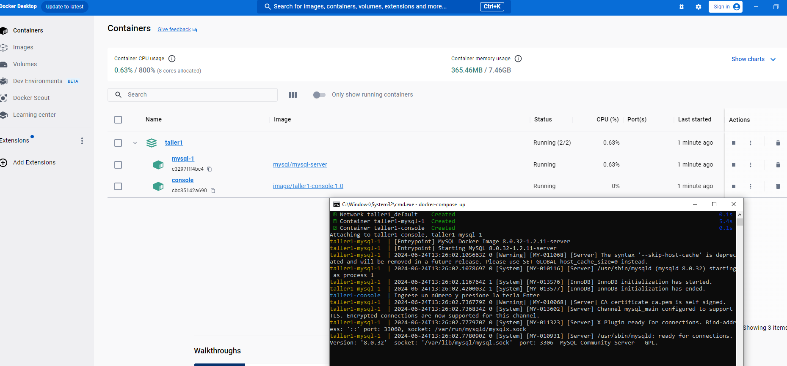

# Cierre de brechas #

## Taller1 ##

| **Área**     | FDLM |
| ------------ | ------------------------------------------- |
| **Contacto** | Edison Alberto García Aguirre edison.garcia@sofka.com.co|

#### Tabla de contenido

- [Crear imagen del proyecto taller1-console](#crear-proyecto)
- [Crear contenedores con docker-compose](#crear-contenedores)
- [Configurar permisos MySql](#configuración-mysql)
- [Ejecutar proyecto](#ejecutar-proyecto)

  
#### Crear Proyecto

1. Clonar el repositorio https://github.com/edisongarcia3797/Taller1.git o descargar los fuentes en la máquina que se ejecutará.

2. Con Docker Desktop instalado en la máquina, desde una consola de comandos CMD ejecute el siguiente comando:
    docker build -t image/taller1-console:1.0 D:\Proyectos\FDLM\Taller1
Asegúrese que la ruta que contiene el comando sea correcta.
Ejemplo:

Si el comando se ejecuta correctamente, se debería visualizar la imagen de la siguiente manera:
Ejemplo:

 #### Crear Contenedores

1. Desde una consola de comandos CMD y sobre la ruta del proyecto especificada, ejecute el siguiente comando:
    docker-compose up
Ejemplo:

Si el comando se ejecuta correctamente, se debería visualizar Docker Desktop de la siguiente manera:
Ejemplo:

 #### Configuración MySql
 
1. Desde ima cpmspña de cp,amdps CMD, ejecute el siguiente comando:
    docker exec -it c3297fff4bc443a308a93f1f00a883ea9011eeed976be48725921f3983fb42d6 mysql -u root -p
Asegúrese que el comando contenga el identificador del contenedor de base de datos.
Ejemplo:

2. Ingrese la contraseña 12345
Ejemplo:

3. Configurar permisos al usuario root ejecutando el siguiente comando
     GRANT ALL PRIVILEGES ON *.* TO 'root'@'%' WITH GRANT OPTION;
Ejemplo:

4. Asignar permisos al usuario root ejecutando el siguiente comando
     FLUSH PRIVILEGES;
Ejemplo:

 #### Ejecutar proyecto

1. Desde ima cpmspña de cp,amdps CMD, ejecute el siguiente comando:
    docker attach cbc35142a6902639fe5bb5dadbd5e27106faaf21452c32cda43095e0e2bad3aa
Asegúrese que el comando contenga el identificador del contenedor del proyecto Taller1.
Ejemplo:

Cualquier observación, duda o inquietud con la ejecuión me pueden llamar al celular: 3105486105 o cantactarme al corrreo edison.garcia@sofka.com.co
